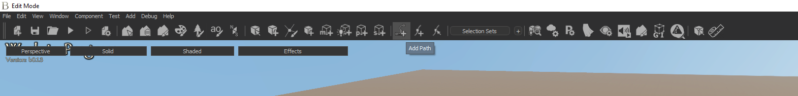
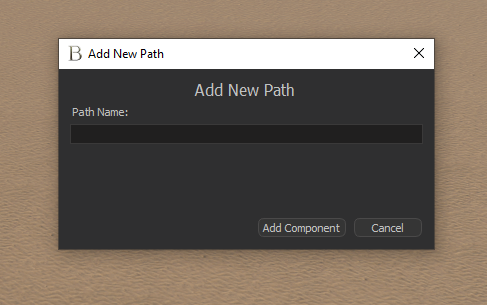
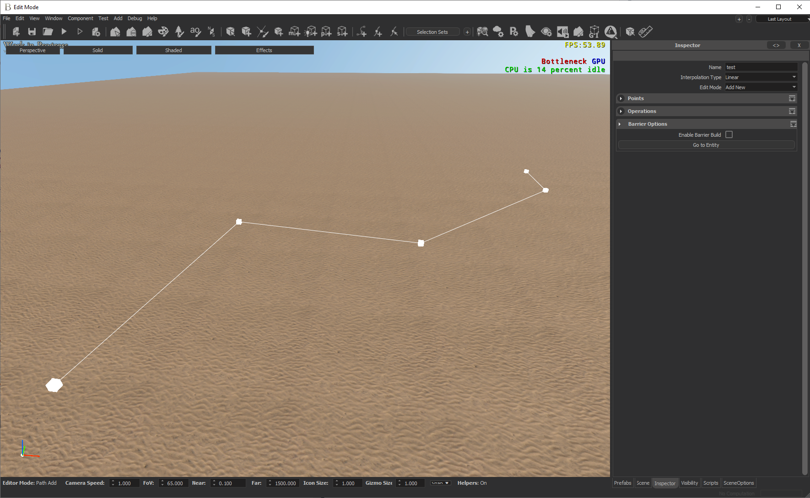
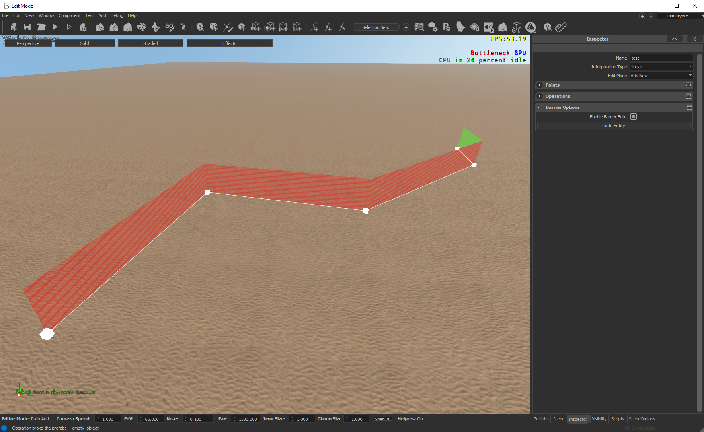
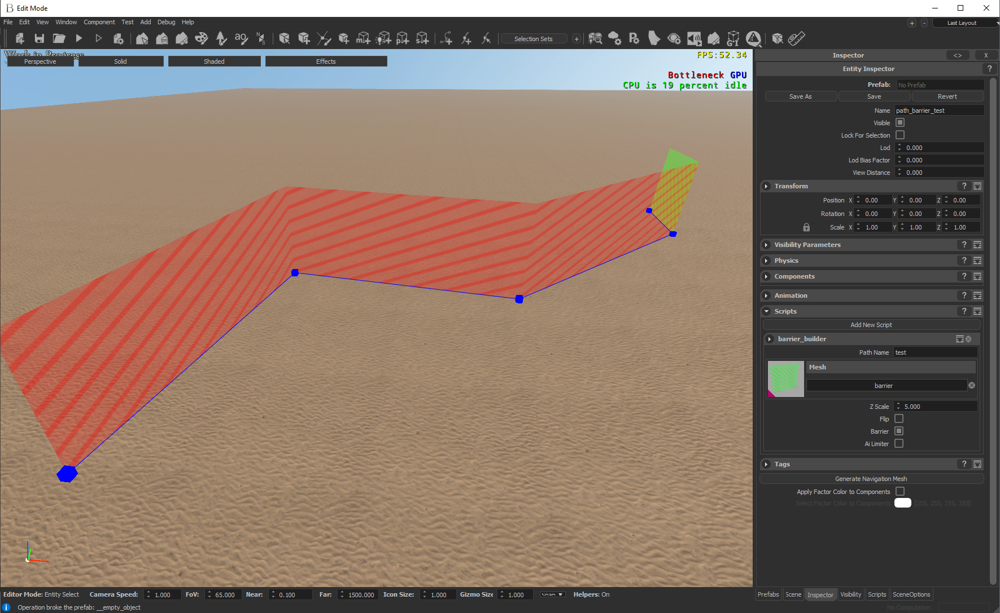

## Introduction

Barrier Builder is a tool that helps artist to generate barriers over walls to prevent agents to fall down.

## Usage

- Create a path, you can use the button on toolbar

- Give a name to path

- Build your path as you wish

- Press “Enable Barrier Build” chekbox on path inspector, it will create your barrier entity for you.

- You can go to that entity with “Go to Entity” Button and chnage its options like height, the entity named as “path_barrier_PATHNAME”

