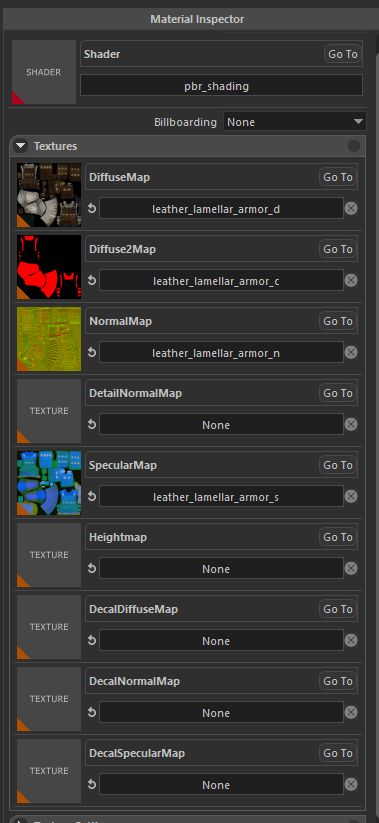
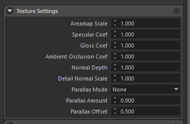
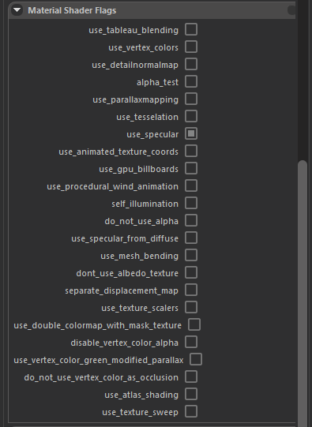
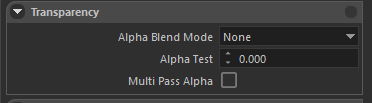
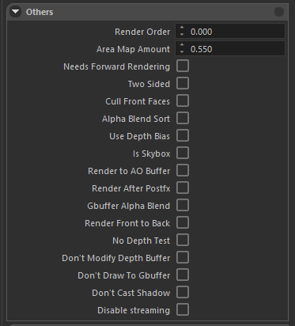
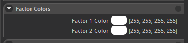

## Overview
 
 
 
Our proprietary game engine uses standard metallic PBR pipeline for material authoring. 
New materials can easily be created after navigating to a folder, right click on empty space, and select **Create > Material**. 
 
Material editor can be opened by double clicking an existing material in the resource browser. 
 
 
 
## Inspector

#### Shader
 
 
 
You can select apporopriate shader from this Shader Selection widget. 
There are a few mainly used shaders; most important ones are pbr_metallic and pbr_shading. 
 
#### pbr_shading
 
This shader is heavily used and exists just because our engine did not use PBR shading pipeline in the early years of development, most content was not created for PBR pipeline, so this shader is created to support our already existing content and only used during the transition phase. 
New content should not use this shader, instead you should use pbr_metallic. 
 
#### pbr_metallic
 
This is what you should use most of the time. This shader uses standard metallic PBR pipeline and inputs are compatible with most texture authoring softwares. 
**Inputs**: 
Albedo and Normal: These are pretty standard, outputs of texture authoring softwares can directly be used. Specular: This texture uses its 4 channel for different purposes. Red channel contains Metallic information, Green channel contains Glossiness (inverse of Roughness), Blue channel contains Ambient Occlusion, and Alpha channel contains Translucency (for vegetation shaders only) 
 
#### grass
 
This shader is a derivative of pbr_metallic, and should only be used on grass meshes. Contains special effects like wind animation, sway animation, smooth LOD transition, color multiplication from terrain, etc. 
 
#### flora_leaf
 
This shader is a derivative of pbr_metallic, and should only be used on leaf parts of trees / bushes. Contains special effects like wind animation, sway animation, color multiplication from terrain, smooth LOD transition, translucency (Alpha channel of Specular texture), etc. 
 
#### flora_bark
 
This shader is a derivative of pbr_metallic, and should only be used on bark parts of trees / bushes. Contains special effects like wind animation, smooth LOD transition, etc. 
 
## Textures
 
 
 
This panel is used to set input textures of shaders. 
Texture names are self explanatory but there are a few special cases. 
 
#### Diffuse2Map
 
This input is used internally by engine to create special effects / blendings like Shield Banner Paintings, Banner texture in this slot will only appear where Diffuse 1 Texture contains alpha. Usage of this texture really depends on the shader used. 
 
#### DetailNormalMap
 
This input is used to create micro imperfections and additional high frequency detail on top on regular normal mapping. Scale of this texture can be adjusted in Texture Settings panel 
 
#### HeightMap
 
This input is used in both Parallax Occlusion Shading, and Displacement. 
 
#### Decal(\_\_\_)Map
 
These inputs are used internally by engine to create skinned decals on entities (like blood and mud on agents). 
 
## Texture Settings
 
 
 
This setting can be used to adjust textures further for more variation and tweaking. Some settings are only used for some special shaders to pass custom parameter. 
 
#### Areamap Scale
 
Used internally for parameter passing. 
 
#### Specular Coef
 
Metallic channel (Red channel of Specular texture) is multiplied by this value in shader. 
 
#### Gloss Coef
 
Gloss channel (Green channel of Specular texture) is multiplied by this value in shader. 
 
#### Ambient Occlusion Coef
 
AO channel (Blue channel of Specular texture) is multiplied by this value in shader. 
 
#### Normal Depth
 
Normal textures X and Y channels are multiplied by this value. If you set a value close to Zero, surface will appear more flat since X and Y values will be close to zero and only Z direction is contributed to normal mapping. 
 
#### Detail Normal Scale
 
This parameters sets how many times the detail textures should tile. Higher values increases frequency. 
 
#### Parallax Mode
 
You can select displacement method to use for this material. Options are, Parallax or Displacement. Both require a heightmap texture. Parallax uses Parallax Occlusion Mapping in shader, Displacement uses hardware tesselation. 
 
#### Parallax Amount
 
Intensity of displacement effect. 
 
#### Parallax Offset
 
Sets the middle value to a desired height. (Value of 0.5 in heightmap). 
 
## Material Shader Flags
 
 
 
You can enable and disable some compile time conditionals in shaders to enable/disable some effects. These are compile time flags and the Material shader will be compiled with these flags. 
Some important onces are: 
 
#### use_detailnormalmap
 
This flag should be enabled to utilize Detail Normal Map feature. 
 
#### alpha_test
 
Diffuse 1 textures alpha values are used as a cut-out texture. Alpha threshold can be specified in Transparency panel. 
 
#### use_specular
 
This flag should be enabled in all cases. It is only here for lagecy reasons. 
 
#### use_procedural_wind_animation
 
Can be enabled to create a very simple and cheap, sine wave wind effect. Mostly used for tents / flags. (Should not be mistaken with cloth physics feature). 
 
#### self_illumination
 
Enables self illumination. Illumination texture should be specified in Diffuse 2. Brightness parameters can be adjusted in Vector Arguments panel. 
 
#### use_specular_from_diffuse
 
Never ever use this. It is only used in pbr pipeline transitioning phase and only here for legacy reasons. Simply grayscales the diffuse texture, and uses it as specular texture. 
 
#### use_double_colormap_with_mask_texture
 
Used internally to create team color effect in clothing. A special texture is created to specify which parts of clothing should be affected by team colors. A simple Red / green texture for primary and secondary colors is specified in Diffuse 2 texture. Primary and Secondary colors are set by gameplay code as Factor Colors. 
 
## Transparency
 
 
 
Alpha blend mode and Alpha Test threshold values can be specified here.
Multi Pass Alpha feature can also be enabled here. This technique renders the mesh twice with both alpha test and alpha blend to create bulky but smooth looking alpha testes meshes. (Alpha test in middle areas for high coverage but smooth alpha blended gradients on edges, such as Hair). 
 
## Others
 
 
 
This panel is usually for technical / internal usage and mostly used to create materials for core engine features. 
 
## Vector Arguments
 
 
 
This panel contains two Vector Arguments. Both containing 4 real values, with a total of 8. 
These vector arguments are used as parameters for some special shader effects, like setting the brightness of Self Illumination, speed and direction of Texture Sweep, etc. 
What changes with which vector argument is really depends on the effects it is used for. 
 
## Factor Colors
 
 
 
These colors are multiplied with internal Factor Color on meshes that are usually changed using gameplay code. If you really want some texture to be slightly darker, greener etc. you can multiply them using this panel. 
 
## Vertex Layout
 
 
 
This panel used to specify Vertex Layout that should be used by Vertex Shaders. 
 
#### Bump Map
 
Should be enabled in most cases (Standard PBR requires this). 
 
#### Skinning and Skinning Precise
 
If your material is going to be used with a skinned mesh, enable Skinning, if your skinned mesh is quite large that has important small polygons (like eyes) enable Skinning Precise. (This disables some optimizations so only use if it is really necessary). 
 
#### Double UV
 
Enable if your custom shaders require double UV channels. 
 
#### PostFX
 
Used internally by engine. 
 
