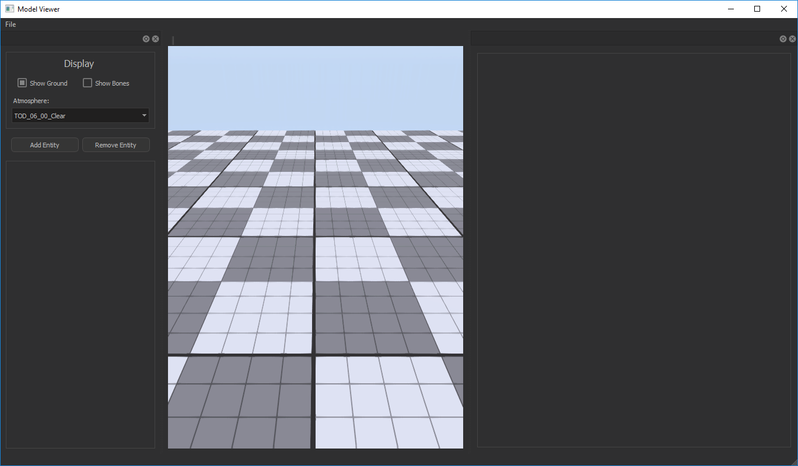
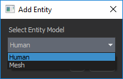
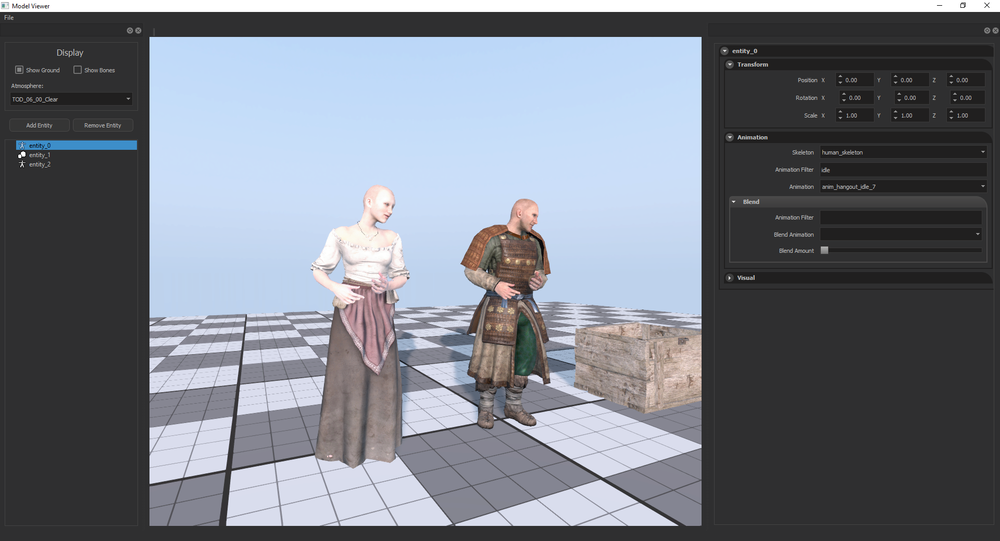
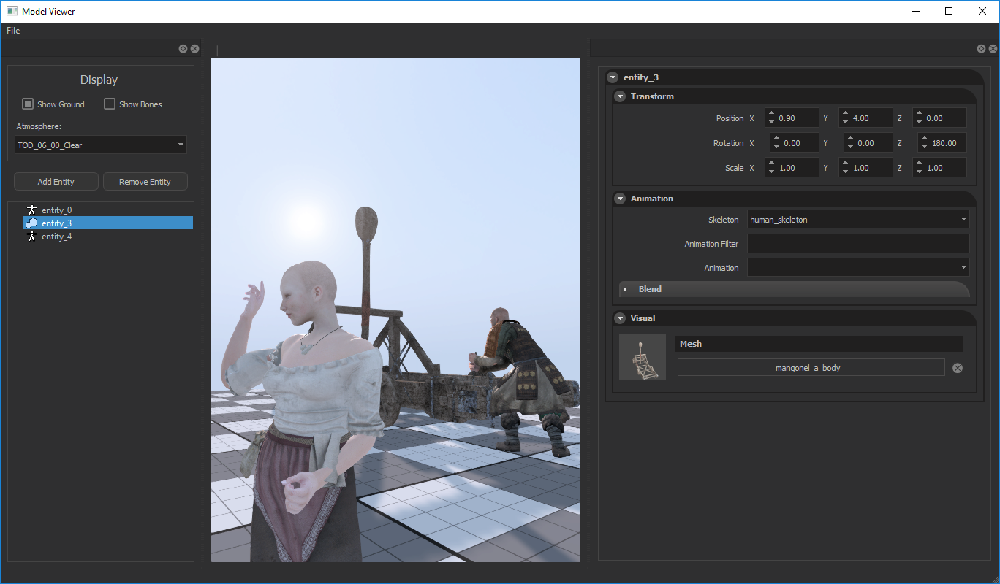

The Model Viewer can be accesed from; Editor > Window > Show Model Viewer

From the left panel, you can change Atmosphere, hide/show ground, or add as many entities as you want. The entities can either be Human or simple Mesh. Pressing Add Entity will open a modal window for you to select the entity type.

### Transform

From this panel, you can set entities Tranform, Rotation, and Scale.

### Animation

From this panel, you can choose Skeleton type, and Animation.

You can also filter animations by their name.

Filtering system is quite strong through all the engine, so you can fine tune your filtering. Some examples;

idle = Will filter animations that contains “idle”

.idle = Will filter animations that starts with “idle”

idle. = Will filter animations that ends with “idle”

-idle = Will filter animations that does not contain “idle”

— You can also use combinations of those filters by putting a space between them
“idle -barmaid 2.” = Will filter animations that contains “idle”, and does not contains “barmaid”, and ends with “2”. (like “guard_idle_2” which fits this condition)

“idle hangout 7” = Will filter animations that contains “idle”, “hangout”, and “7”. (like “anim_hangout_idle_7” which fits this condition)

— You can also blend an another animation using the blend panel.

### Visuals

From this panel, you can put any mesh at any part of the human, and you can choose this humans gender.

## Save / Load scene

You can also Save / Load the current working scene, by clicking; File > Save Scene > *..Save Name..*

Then you can load it with; File > Load Saved Scene > *..Write Saved Name..*

Which will restore everyting to the state where you saved it.
