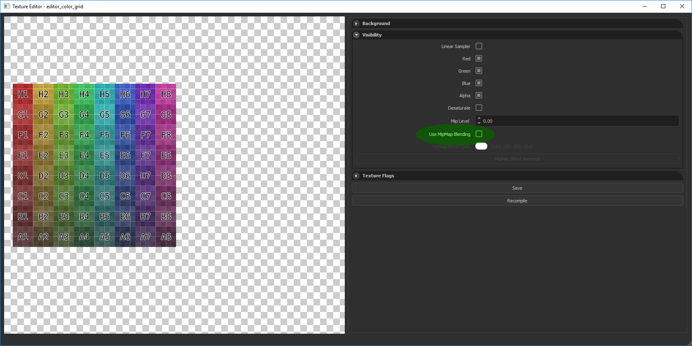
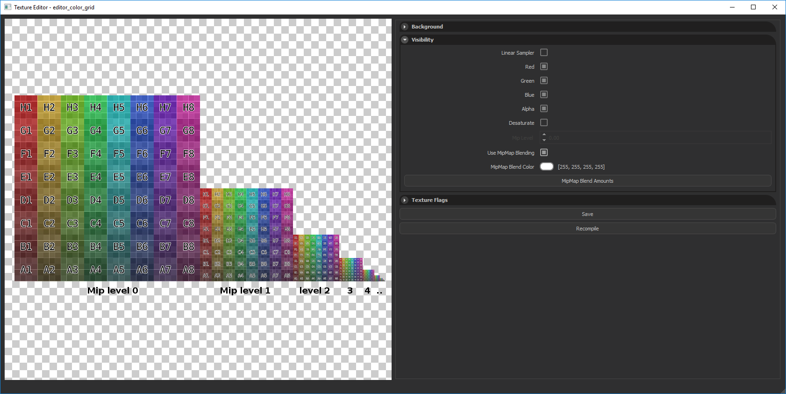
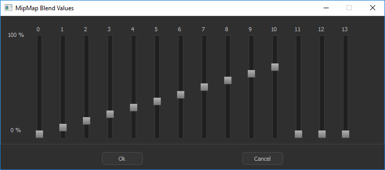
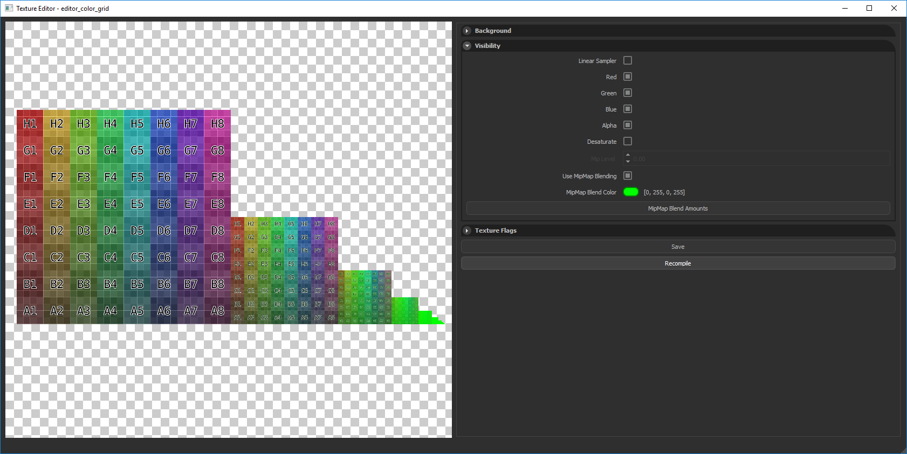

The Texture Editor can be accesed from; Editor > Window > Show Resource Browser > *..Search for Texture..* > *..Double Click on Texture..*

From the Texture Inspector (Right Panel), you can enable/disable MipMap blending by toggling Use Mipmap Blending checkbox. When you enable MipMap Blending, you will see all mip levels of the selected texture next to each other in Preview Window.

Clicking on **MipMap Blend Amounts** will open open a new window where you can adjust blend amounts for every mip level.

Then you can select **MipMap Blend Color (1)** and click **Recompile (2)** button to apply blending. The result will be immediately visible in Preview Window and also in Game.

