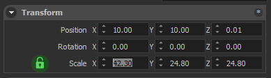

## Transform Panel

Transform panel allows you to change position, rotation and scale properties of the selected entities. All of these values are relative to the parent of the selected entity. If Entity has no parent, then they are the Global values. (in [**World**](#world-space) space).

### Scale

#### Locked

If the lock icon is in locked state, changing any component of scale parameter will set all scale components to the same value, entity will be in uniform scaling mode.

#### Unlocked

If the lock icon is in unlocked state, every scale component can be changed independently, and will allow non-uniform scaling.

## Transform with Gizmo

### Transform modes

All of the transformation can also be done using Gizmo. Gizmo can be activated by selecting an entity (or multiple entities) and pressing one of the hotkeys below.

|ROTATE|TRANSLATE|SCALE|
|-|-|-|
|Hotkey: R	|Hotkey: T	|Hotkey: Y|
||||

### Transform spaces

Gizmo can work in three different spaces; [**World**](#world-space) space, [**Local**](#local-space) space and [**Screen**](screen-space) space.

#### World space

World coordinates is just a fixed, parent coordinate system. This is the global coordinate system that everything is defined relative to. World Coordinate has a fixed \[1, 0, 0\] in the X direction, \[0, 1, 0\] in the Y direction, and \[0, 0, 1\] in the Z direction.

#### Local space

Local coordinates are relative to the entity itself, every transform is defined such as that the center of the entity is center of the universe.

#### Screen space

Screen space coordinates are relative to the camera. Right of your viewport is always the X axis, Top is always the Y axis, and forward is always the -Z (minus Z) axis.

## Entity Tag System

An entity on editor can be identified by a tag defined by the user.

### Adding Tags

In the Entity Inspector, under the “Tags” title, there is a button with label “Add New Tag”. This button opens a window asking for the name of the tag.

### Using an Existing Tag

After clicking on the “Add New Tag” button, from the dropdown menu in the window, you can select tags, which were added to the current scene entities before.

### A Special Case: Prefabs

If you are modifying a prefab entity, adding tags to the prefab does not break it. In other words, if you change the prefab after tagging the prefab entity in the scene, the scene entity will have all the changes as well. The tags are stored in the xml files with “&lt; tags &gt;… &lt; / tags &gt;” syntax. (without the white spaces between characters)

