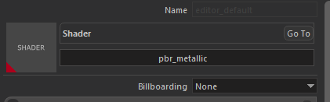

# Overview

Our proprietary game engine uses standard metallic PBR pipeline for material authoring.
New materials can easily be created after navigating to a folder, right click on empty space, and select **Create > Material**.

Material editor can be opened by double clicking an existing material in the resource browser.

# Inspector

## Shader

You can select apporopriate shader from this Shader Selection widget.
There are a few mainly used shaders; most important ones are pbr_metallic and pbr_shading.

## pbr_shading

This shader is heavily used and exists just because our engine did not use PBR shading pipeline in the early years of development, most content was not created for PBR pipeline, so this shader is created to support our already existing content and only used during the transition phase.
New content should not use this shader, instead you should use pbr_metallic.

## pbr_metallic

This is what you should use most of the time. This shader uses standard metallic PBR pipeline and inputs are compatible with most texture authoring softwares.
**Inputs**:
Albedo and Normal: These are pretty standard, outputs of texture authoring softwares can directly be used. Specular: This texture uses its 4 channel for different purposes. Red channel contains Metallic information, Green channel contains Glossiness (inverse of Roughness), Blue channel contains Ambient Occlusion, and Alpha channel contains Translucency (for vegetation shaders only)

## grass

This shader is a derivative of pbr_metallic, and should only be used on grass meshes. Contains special effects like wind animation, sway animation, smooth LOD transition, color multiplication from terrain, etc.

## flora_leaf

This shader is a derivative of pbr_metallic, and should only be used on leaf parts of trees / bushes. Contains special effects like wind animation, sway animation, color multiplication from terrain, smooth LOD transition, translucency (Alpha channel of Specular texture), etc.

## flora_bark

This shader is a derivative of pbr_metallic, and should only be used on bark parts of trees / bushes. Contains special effects like wind animation, smooth LOD transition, etc.

# Textures

This panel is used to set input textures of shaders.
Texture names are self explanatory but there are a few special cases.

## Diffuse2Map

This input is used internally by engine to create special effects / blendings like Shield Banner Paintings, Banner texture in this slot will only appear where Diffuse 1 Texture contains alpha. Usage of this texture really depends on the shader used.

## DetailNormalMap

This input is used to create micro imperfections and additional high frequency detail on top on regular normal mapping. Scale of this texture can be adjusted in Texture Settings panel

## HeightMap

This input is used in both Parallax Occlusion Shading, and Displacement.

## Decal<u>(___)</u>Map

These inputs are used internally by engine to create skinned decals on entities (like blood and mud
