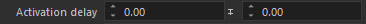
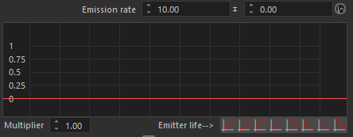

## Parameter types

#### Random-bias parameters

These parameters consists of two numerical values: base value and a random bias value respectively.

Values of this parameter are evaluated as value=base+(random value in -bias,bias range)

#### Random-bias parameters with curve(s)

These parameters consists of two numerical values and one or two curves: base value ,a random bias value and one or two curves.

Most of the curves take emitter life or particle life as input. Values of this parameter are usually evaluated as value=(base+(random value in -bias,bias range)) * curve_1 * curve_2. There is also a multiplier value for each curve which you can easily scale curve values vertically.

## LOD Settings

You can create several lods starting from specified distances in **LOD Settings** pane. Each lod independently defines its own emitters so you can omit some emitters from higher lods or create new ones while creating a lower lod.

At the top of Inspector there are two tab bars. First bar contains one tab for each LOD while the second bar contains one tab for each emitter belongs to selected lod. Just like a web browser you can create new tabs(emitter or lod) by clicking on “+” button or remove existing ones by clicking on “x” buttons.

## Emitter settings

Each emitter has its own set of parameters. In this section these parameters will be covered briefly.

<table>
    <thead>
        <tr>
            <th>Parameter</th>
            <th>Description</th>
        </tr>
    </thead>
    <tbody>
        <tr>
            <td>Hide</td>
            <td>Hide emitter in viewport</td>
        </tr>
        <tr>
            <td>Emitter name</td>
            <td>Name of the emitter. Also displayed on emitter's tab</td>
        </tr>
        <tr>
            <td>Parent emitter</td>
            <td>Parent emitter which has the same LOD level with this emitter</td>
        </tr>
        <tr>
            <td>Parent activation event</td>
            <td>Determines when to activate this emitter.
                <table>
                    <tr>
                        <td>particle_spawn</td>
                        <td>particle_spawn</td>
                    </tr>
                    <tr>
                        <td>particle_spawn</td>
                        <td>particle_spawn</td>
                    </tr>
                    <tr>
                        <td>particle_spawn</td>
                        <td>particle_spawn</td>
                    </tr>
                </table>
            </td>
        </tr>
        <tr>
            <td>LOD</td>
            <td>Which LOD levet this emitter belongs to</td>
        </tr>
        <tr>
            <td>Min config</td>
            <td>Minimum particle quality option this emitter requires to be activated</td>
        </tr>
        <tr>
            <td>Max config</td>
            <td>Maximum particle quality option this emitter stays active</td>
        </tr>
    </tbody>
</table>

### Emission parameters

<table>
    <thead>
        <tr>
            <th>Parameter</th>
            <th>Description</th>
        </tr>
    </thead>
    <tbody>
        <tr>
            <td colspan="2">Spawner Behavior</td>
        </tr>
        <tr>
            <td>Emission rate</td>
            <td>Amoun of particles this emitter will spawn per unit. This value interpreted differently according to emission behavior.
                <ul>
                    <li>As default, emission rate is calculated as particle count per second</li>
                    <li>If "Emit while moving" is active it is calculated as particle count per meter emitter has travelled</li>
                    <li>If "Emit at once" is active all particles are spawned in a single simulation tick and then emitter stops</li>
                </ul>
            </td>
        </tr>
        <tr>
            <td>Emit at once</td>
            <td>All particles are spawned in a single simulation tick and then emitter stops.</td>
        </tr>
        <tr>
            <td>Emit while moving</td>
            <td>Particles are emitted only if emitter moves some distance.</td>
        </tr>
        <tr>
            <td>Don't emit while moving</td>
            <td>Particles are not emitted if emitter moves.</td>
        </tr>
        <tr>
            <td>Emit while moving speed threshold</td>
            <td>Emitter is considered to be moving only if its speed is greater than this threshold.</td>
        </tr>
        <tr>
            <td>Emitter life</td>
            <td>Life of emitter in seconds. "0" means emitter will be alive forever.</td>
        </tr>        
        <tr>
            <td>Activation delay</td>
            <td>After particle effect activation, amount of delay in seconds to activate this emitter.</td>
        </tr>
        <tr>
            <td>Max alive particle count</td>
            <td>Hard limit for the number of particles can exist at once</td>
        </tr>
        <tr>
            <td>Emission loop</td>
            <td>Number of iterations this emitter is resetted if it dies. This can be used with "Emit at once" or "Emitter life" parameters</td>
        </tr>
        <tr>
            <td>Warmup time</td>
            <td>Amount of time in seconds to simulate before this emitter is rendered for the first time.</td>
        </tr>        
        <tr>
            <td colspan="2">Spawner Shape</td>
        </tr> 
        <tr>
            <td>Emit volume type</td>
            <td>Determines the shape new particles are spawned in</td>
        </tr>
        <tr>
            <td>Emit box size</td>
            <td>Size of box new particles are spawned in.</td>
        </tr>
        <tr>
            <td>Sphere radius</td>
            <td>Radius of sphere new particles are spawned in.</td>
        </tr>
        <tr>
            <td>Sphere inner radius</td>
            <td>Radius of sphere new particles are <b>not</b> spawned in. Can be used with <b>Sphere radius</b> to create effects like sphere emitting on its surface.</td>
        </tr>
        <tr>
            <td>Disc radius</td>
            <td>Radius of disc new particles are spawned in.</td>
        </tr>
        <tr>
            <td>Disc inner radius</td>
            <td>Radius of disc new particles are <b>not</b> spawned in. Can be used with <b>Disc radius</b> to create effects like disc emitting on its boundaries.</td>
        </tr>
        <tr>
            <td>Emission offset</td>
            <td>Offset of emitter shape with respect to particle system's origin</td>
        </tr>
        <tr>
            <td>Emission rotation</td>
            <td>Rotation of emitter shape with respect to particle system's orientation</td>
        </tr>
        <tr>
            <td>Emit on terrain</td>
            <td>Particles are spawned on terrain surface</td>
        </tr>             
        <tr>
            <td colspan="2">Initial velocity</td>
        </tr>
        <tr>
            <td>Emit velocity model</td>
            <td>Determines how initial velocities of particles are calculated
                <table>
                    <tr>
                        <td>random_velocity_components</td>
                        <td>Initial velocity has three random components in XYZ axes evaluated from three random-biased values of <b>Emission velocity</b> parameter</td>
                    </tr>
                    <tr>
                        <td>random_in_cone</td>
                        <td>Particles spawn at the apex of cone and their velocity vector resides in cone. Shape of cone is determined by <b>Cone angle</b> parameter</td>
                    </tr>
                </table>
            </td>
        </tr>
        <tr>
            <td>Cone angle</td>
            <td>Apex angle of emitter cone in degrees</td>
        </tr>
        <tr>
            <td>Emission velocity</td>
            <td>
                <ul>
                    <li>For <b>randome_velocity_component</b> emitters, random base and bias velocity components in m/s for XYZ axes respectively</li>
                    <li>For <b>randome_in_cone emitters</b>, magnitude of initial velocity</li>
                </ul>
            </td>
        </tr>
        <tr>
            <td>Radial velocity</td>
            <td>Additional velocity applied to particles in direction from center of emitter to particle's spawn position.</td>
        </tr>
        <tr>
            <td>Emission speed limit</td>
            <td>Maximum speed of particle's initial velocity</td>
        </tr>
        <tr>
            <td>Fixed particle initial speed</td>
            <td>Forces particles to have same speeds during spawn. "0" means limit is disabled</td>
        </tr>
        <tr>
            <td>Rotation speed</td>
            <td>Initial angular speed of particle wrt to its center. Particle center can be offsetted with <b>Visual::Orientation::Quad bias</b> parameters</td>
        </tr>
        <tr>
            <td>Radial initial rotation speed</td>
            <td>Initial angular velocity is calculated with respect to particle's spawn position and emitter's origin.
                <table>                
                    <tr>
                        <td>
                            
                            
                        </td>
                    </tr>
                    <tr>
                        <td>Difference between positive and negative values for Radial initial rotation speed</td>
                    </tr>
                </table>
            </td>
        </tr>
        <tr>
            <td>Local emit direction</td>
            <td>Geometric emission parameters are transformed into local space of emitter.</td>
        </tr>
        <tr>
            <td>Inherit emitter velocity</td>
            <td>Emitter's current velocity is added to particle initial velocity. Can have positive or negative values to create different effects.</td>
        </tr>           
        <tr>
            <td colspan="2">Other parameters</td>
        </tr>
        <tr>
            <td>Particle life</td>
            <td>Amount of time particle survive in seconds</td>
        </tr>
        <tr>
            <td>Initial rotation</td>
            <td>Initial rotation of particle. Used only if particles use billboard orientations.</td>
        </tr>
    <tbody>
</table>

### Movement paremeters

<table>
    <thead>
        <tr>
            <th>Parameter</th>
            <th>Description</th>
        </tr>
    </thead>
    <tbody>
        <tr>
            <td colspan="2">Force</td>
        </tr>
        <tr>
            <td>Gravity</td>
            <td>Constant force affecting particles continuously. Always evaluated in global space.</td>
        </tr>
        <tr>
            <td>Local force</td>
            <td>Constant force affecting particles continuously. Always evaluated in emitter's local space.</td>
        </tr>
        <tr>
            <td>Wind effect</td>
            <td>Multiplier for scene's wind parameters. If there is no wind in scene, this parameter has no effect.</td>
        </tr>
         <tr>
            <td colspan="2">Vector field</td>
        </tr>
        <tr>
            <td>Vector field</td>
            <td>Vector field asset to use for this emitter. By default vector field is placed as a unit cube whose one corner is on the origin</td>
        </tr>
        <tr>
            <td>Strength</td>
            <td>Multiplier for vector field values. Greater values result greater forces on particles.</td>
        </tr>
        <tr>
            <td>Tightness</td>
            <td>Blend amount for vector field's interpretation. "0" means vector field acts as a force field which means it just apply force to particles but not modify their current movement direction directly. "1" means vector field acts as a velocity field which means particle's current velocity replaced with vector field's coressponding value.</td>
        </tr>
        <tr>
            <td>Scale</td>
            <td>Scale of vector field's unit cube.</td>
        </tr>
        <tr>
            <td>Offset</td>
            <td>Offset of vector field's unit cube.</td>
        </tr>
        <tr>
            <td>Local simulation</td>
            <td>Particles are spawned in emitter's local space instead of global space and move with emitter</td>
        </tr>
        <tr>
            <td>Damping</td>
            <td>Damping value for particle's linear velocity</td>
        </tr>
        <tr>
            <td>Angular damping</td>
            <td>Damping value for particle's angular velocity</td>
        </tr>
    </tbody>
</table>

### Collision paremeters

<table>
    <thead>
        <tr>
            <th>Parameter</th>
            <th>Description</th>
        </tr>
    </thead>
    <tbody>    
        <tr>
            <td>Enbale</td>
            <td>Enable particle collisions</td>
        </tr>
        <tr>
            <td>Collide with objects</td>
            <td>Enable collision with objects. By default, particles collide only with terrain.</td>
        </tr>
        <tr>
            <td>Collision behavior</td>
            <td> There are three different collision behavior
                <table>                
                    <tr>
                        <td>normal</td>
                        <td>Particles bounce from surface according to collision velocity and direction</td>
                    </tr>
                    <tr>
                        <td>stick</td>
                        <td>Particles stick to surface they collide</td>
                    </tr>                    
                    <tr>
                        <td>kill</td>
                        <td>Particles die when they collide</td>
                    </tr>
                </table>
            </td>
        </tr>
        <tr>
            <td>Damping</td>
            <td>Damping amount for particle's linear velocity on each collision</td>
        </tr>        
        <tr>
            <td>Angular damping</td>
            <td>Amount of damping for particle's angular velocity on each collision</td>
        </tr>           
        <tr>
            <td colspan="2">Decal</td>            
        </tr>               
        <tr>
            <td>Create decal on collision</td>
            <td>####</td>
        </tr>                
        <tr>
            <td>Create decal on each collision</td>
            <td>####</td>
        </tr>               
        <tr>
            <td>Start index</td>
            <td>####</td>
        </tr>              
        <tr>
            <td>End index</td>
            <td>####</td>
        </tr>              
        <tr>
            <td>Min scale</td>
            <td>####</td>
        </tr>                      
        <tr>
            <td>Max index</td>
            <td>####</td>
        </tr>              
        <tr>
            <td>Randomize rotation</td>
            <td>####</td>
        </tr>              
        <tr>
            <td>Permanent decal</td>
            <td>####</td>
        </tr>              
        <tr>
            <td>Decal materials</td>
            <td>####</td>
        </tr> 
    </tbody>
</table>

### Visual paremeters

<table>
    <thead>
        <tr>
            <th>Parameter</th>
            <th>Description</th>
        </tr>
    </thead>
    <tbody>    
        <tr>
            <td>Billboard type</td>
            <td>
                <table>
                    <tr>
                        <td>none</td>
                        <td>Particles are aligned at random directions</td>
                    </tr>
                    <tr>
                        <td>3d</td>
                        <td>Particles are aligned to face the camera</td>
                    </tr>
                    <tr>
                        <td>2d</td>
                        <td>Particles are aligned to face the camera but only with horizontal axes(XY).</td>
                    </tr>
                    <tr>
                        <td>turn_to_velocity_forward</td>
                        <td>Particle's front direction is aligned with their movement direction</td>
                    </tr>
                    <tr>
                        <td>turn_to_velocity_side</td>
                        <td>One of particle's side direction is aligned with their movement direction. They also try to face the camera as much as possible.</td>
                    </tr>
                </table>
            </td>
        </tr>
        <tr>
            <td>Use fixed billboard direction</td>
            <td>Particles are aligned with direction specified with <b>Fixed billboard direction</b> parameter.</td>
        </tr>
        <tr>
            <td>Fixed billboard direction</td>
            <td>Fixed billboard direction to use with <b>Use fixed billboard direction</b></td>
        </tr>
        <tr>
            <td>Quad scale</td>
            <td>Constant scale values for particles. Can be used to apply non-uniform scales(e.g. rectangular particles)</td>
        </tr>
        <tr>
            <td>Quad bias</td>
            <td>Constant offset values for particles to change their pivot position.(e.g. particles rotation around some arbitrary point instead of their center)</td>
        </tr>
        <tr>
            <td colspan="2">Size</td>
        </tr>
        <tr>
            <td>Particle size</td>
            <td>Particle size in meters</td>
        </tr>        
        <tr>
            <td>Particle size curve operation</td>
            <td>By default, paramter curves are applied as multiplication but there are two options for size curves : multiplication and addition</td>
        </tr>       
        <tr>
            <td>Scale with respect to emitter velocity</td>
            <td>Particle's spawn sizes are modified according to emitter's current velocity</td>
        </tr>      
        <tr>
            <td>Skew with respect to particle velocity</td>
            <td>Particles are skewed along their movement direction according to their current speed</td>
        </tr>
        <tr>
            <td>Skew particle velocity limit</td>
            <td>Maximum skew limit for particles</td>
        </tr>
        <tr>
            <td colspan="2">Render</td>            
        </tr>
        <tr>
            <td>Material</td>
            <td>Material to use with particle quads or sample mesh. To use with particle systems materials must use "particle_shading" shader otherwise they are ignored.  If any sample mesh is specified its materials are overriden with the specified material. There is no shader restriction to use with sample mesh but some features are only supported with "pbr_shading" shader.
            </td>
        </tr>
        <tr>
            <td>Particle color</td>
            <td>Particle color is interpreted in two different ways according to <b>Color gradient behavior</b> parameter.</td>
        </tr>
        <tr>
            <td>Color gradient behavior</td>
            <td>
                <table>
                    <tr>
                        <td>color_over_time</td>
                        <td>Color gradient values are used as a timeline and particle color changes according to its remaining life</td>
                    </tr>
                    <tr>
                        <td>initial_color</td>
                        <td>Particles are assigned with a random color selected from color gradient</td>
                    </tr>   
                </table>
            </td>
        </tr>
        <tr>
            <td>Use color from terrain</td>
            <td>Particle colors are multiplied with terrain color where they spawn</td>
        </tr>
        <tr>
            <td>Exposure compensation</td>
            <td>Exposure compensation is used make particles look they have same luminance under all lighting conditions. It works by taking into account average luminance of the scene dynamically. One example might be a glowing flames adjusted for daylight. Without exposure compensation flames might look too bright at nights.  Exposure compensation curve takes <b>time oy day</b> value from atmosphere as input.</td>
        </tr>
        <tr>
            <td>Use spherical normals</td>
            <td>Normals of particle quads are distorted outwards</td>
        </tr>
        <tr>
            <td>Enable point light shading</td>
            <td>Enables point light for this emitter. By default particles are not affected by point lights for performance.</td>
        </tr>
        <tr>
            <td>Enable sky occlusion</td>
            <td>Particles are clipped if there are any occluded above them. Can be used to clip snow particles inside buildings.</td>
        </tr>
        <tr>
            <td>Soften alpha with water</td>
            <td>####</td>
        </tr>
        <tr>
            <td>Use specular</td>
            <td>Enable specular highlights</td>
        </tr>
        <tr>
            <td>Order by view distance</td>
            <td>Particles are ordered by their distance to camera, back to front.</td>
        </tr>
        <tr>
            <td>Backlight multiplier</td>
            <td>Amount of ambient light effect if particle does not get direct light from light sources.</td>
        </tr>
        <tr>
            <td>Diffuse multiplier</td>
            <td>Multiplier for diffuse texture. It is best to leave this value as "1" since tweaking texture brightness with a multiplier may result significant loss of details</td>
        </tr>
        <tr>
            <td>Emissive multiplier</td>
            <td>This parameters behaves differently according to emitter's material.
                <ul>
                    <li>If <b>emissive</b> flag is active in material, diffuse texture will be multiplied with it. In other words it works just like <b>Diffuse multiplier</b></li>
                    <li>If <b>emissive_mask</b> flag is active in material, only emissive parts of texture are multiplied with it</li>
                </ul>
            </td>
        </tr>
        <tr>
            <td>Heatmap multiplier</td>
            <td>Multiplier for heatmap texture. Used with <b>emissive_mask</b> material flag</td>
        </tr>
        <tr>
            <td>Fadeout distance</td>
            <td>Parameter to control how particle fades out when it gets closer to an object. When the distance between particle and the object behind it falls below this parameter particle starts to fade out. </td>
        </tr>
        <tr>
            <td>Fadeout coefficient</td>
            <td>Contorls how fast the particle fades out when it gets closes to the object behind it.</td>
        </tr>
        <tr>
            <td>Camera distance fadeout coefficient</td>
            <td>Controls how fast the particle fades out when it gets closer to camera</td>
        </tr>
        <tr>
            <td>Sample mesh</td>
            <td>Enables emitting meshes instead of quads. To fully use particle system features this mesh should use <b>particle_shading</b> in its materials but it is totally valid to use other generic shaders as well.</td>
        </tr>
        <tr>
            <td>Random sample mesh</td>
            <td>Each particle picks a random submesh from mesh.(Meshes consist of multiple submeshes). If this options is not enabled submeshes are used sequentially for each spawned particle.</td>
        </tr>
        <tr>
            <td colspan="2">Texture sprite</td>
        </tr>
        <tr>
            <td>Type</td>
            <td>
                <table>
                    <tr>
                        <td>none</td>
                        <td>Texture is used as a single image</td>
                    </tr>
                    <tr>
                        <td>animated</td>
                        <td>Texture sprites are rendered sequentially according to sprite parameters.</td>
                    </tr>   
                    <tr>
                        <td>select_random</td>
                        <td>Particles are assigned a random sprite according to sprite parameters.</td>
                    </tr>   
                </table>
            </td>
        </tr>
        <tr>
            <td>Blend sprites</td>
            <td>Texture sprites are blended to achive more smooth transition. It can be useful if sprite count is low.</td>
        </tr>
        <tr>
            <td>Loop</td>
            <td>If animated texture sprite option is selected animation starts over with the first sprite.</td>
        </tr>
        <tr>
            <td>Random sprite</td>
            <td>Range for random sprite selection if random sprite option is selected</td>
        </tr>
        <tr>
            <td>Sprite count x</td>
            <td>Number of sprites in texture horizontally</td>
        </tr>
        <tr>
            <td>Sprite count y</td>
            <td>Number of sprites in texture vertically</td>
        </tr>
        <tr>
            <td>Frame count</td>
            <td>Total number of sprites in texture.</td>
        </tr>
        <tr>
            <td>Frame rate</td>
            <td>Frame rate for animation in frame per second. Used if animated sprite option is selected</td>
        </tr>
    <tbody>
</table>

### Sound paremeters

<table>
    <thead>
        <tr>
            <th>Parameter</th>
            <th>Description</th>
        </tr>
    </thead>
    <tbody>    
        <tr>
            <td>Continuous sound</td>
            <td>Sound for continuous emitters to play when they start emission. Sound is stopped if emitter dies or stops emitting for any reason.</td>
        </tr> 
        <tr>
            <td>One shot sound</td>
            <td>Sound for burst emitters(e.g. <b>Emit at once</b>) to play. These sounds must have a duration and not be looped. They are not explicitly stopped by emitter. Sound is played everytime emitter starts emission(e.g. Emitters with loop option enabled)</td>
        </tr>
    </tbody>
</table>

## Particle shader

Materials using particle shader have some special properties. These settings are set per material and can not be modified from particle settings.

All materials using particle shader must have set their alpha blend mode to **add_modulate_combined** for correct blending during render.
  
|SHADER FLAG|DESCRIPTION|
|-|-|
|emissive|Disables all lighting calculations and particle itself emits light. Particles does not illuminate objects around them.|
|additive|Changes blend mode of material from modulate to add. Color from each particle quad is summed up. Most of the time if you use **emissive** flag you should use this flag too.|
|use_emissive_mask|To handle explosion like effects, which a particle spawns as a bright flame but turns into a diffuse lit smoke, emissive mask is a great option.|
|use_normalmap|Enables normal mapping to add more datails to particle quads|
|use_specular_from_diffuse|If material does not have a specular texture but specular highlights are still required you can enable this option, which derives specular values from albedo values. However it is best to use a separate specular texture since what makes specular highlights visually appealing is the details that albedo texture does not have.|
|use_monochrome_specular|Specular values are derived from specular parameters of the material. They will have no variation on particle surface since all values used are constant across all particles|

Here three different states of a smoke emitter demonstrated:

- **use_emissive_mask** option and point light shading are active. Particles are spawned as flames then turns into smoke. Smoke phase is lit by pointlights
- **use_emissive_mask** option is active without point lights.
- **use_emissive_mask** option is not active. Particles are rendered as smoke

