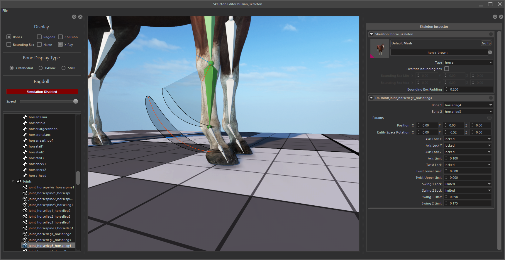
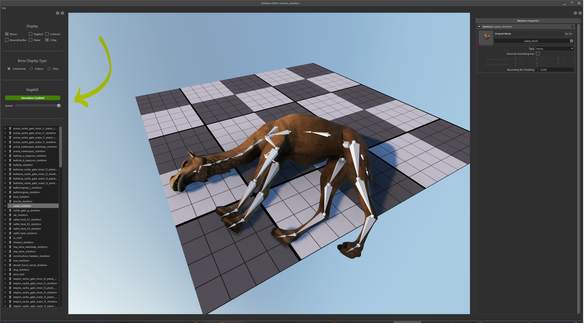
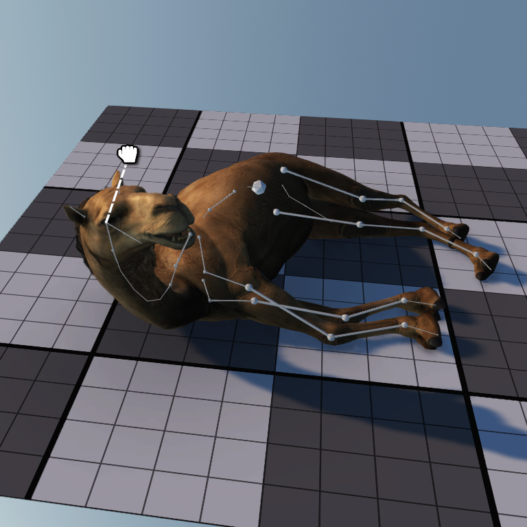

Skeleton editor can be used to edit, bones, joints, and ragdoll parameters of skeletons after importing them using resource browser.

## Editing Bones and Joints

To edit a bone or joint, you can select the item you want from the outliner panel.

This will create an Inspector of bones/joints for you to edit.

All parameters are visualized and all edits will immediately be visible in the preview.

## Joint Properties

### Axis lock

Axis lock limits the movement the child bone in translation space. Can be adjusted independetly for every axis.

**None:** means This joint is not allowed to move in this axis.

**Free:** means This joint is allowed to move freely as far as it can go in this axis.

**Limited:** means This joint is allowed to move to as far as specified distance in this axis. (Axis Limit parameter)

### Twist Lock

Twist lock limits the rotation the child bone in Z axis (Twist axis). Can be adjusted independetly for both sides of twist.

**None:** means This joint is not allowed to rotate.

**Free:** means This joint is allowed to rotate freely as much as it can.

**Limited:** means This joint is allowed to rotate to a certain limit. (Twist Limit parameters)

### Swing Lock

Swing lock limits the rotation the child bone in X and Y axis. Can be adjusted independetly for both sides of twist.

**None:** means This joint is not allowed to swing.

**Free:** means This joint is allowed to swing freely as much as it can.

**Limited:** means This joint is allowed to swing to a certain limit. (Swing Limit parameters)

All of these parameters are visualized in the preview. Feel free to modify and see the effects for yourself.

## Bone Properties

Bone properties can be used to change ragdoll and collision capsules.

Capsule visualization can be enabled in Display panel.

You can change capsule radius, Position 1 (Top of capsule), Position 2 (Bottom of capsule) from Properties panel.

|                                 |                                     |
| ------------------------------- | ----------------------------------- |
|  |  |

## Ragdoll Simulation

Best way to visualize your changes is to enable ragdoll simulation and see your changes in real time.

Simple select a skeleton from outliner, and hit Red “Simulation Enabled/Disabled” button. This will enable ragdoll simulation. Pressing this button again will disable ragdoll simulation and reset the skeleton to T-Pose.

## Testing and Saving changes

You can select the bones and drag them with your mouse to test limits and behaviour of ragdoll.

After you are done with adjusting and testing, you can save all of your changes from the File > Save menu.

Saving will change corresponding .tpac files of every skeleton changed.

