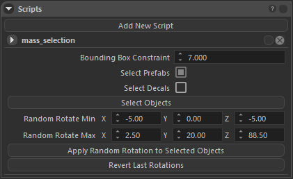
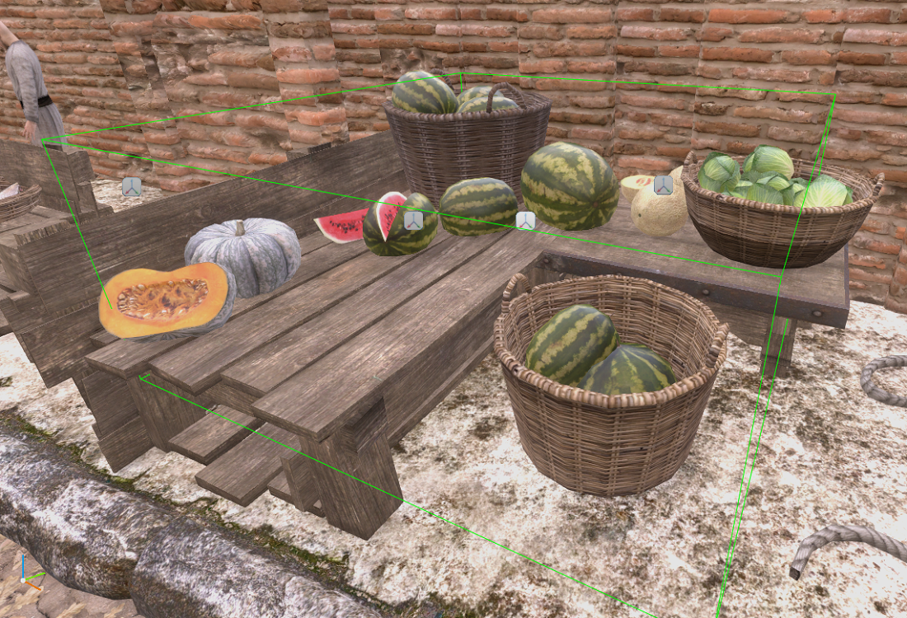
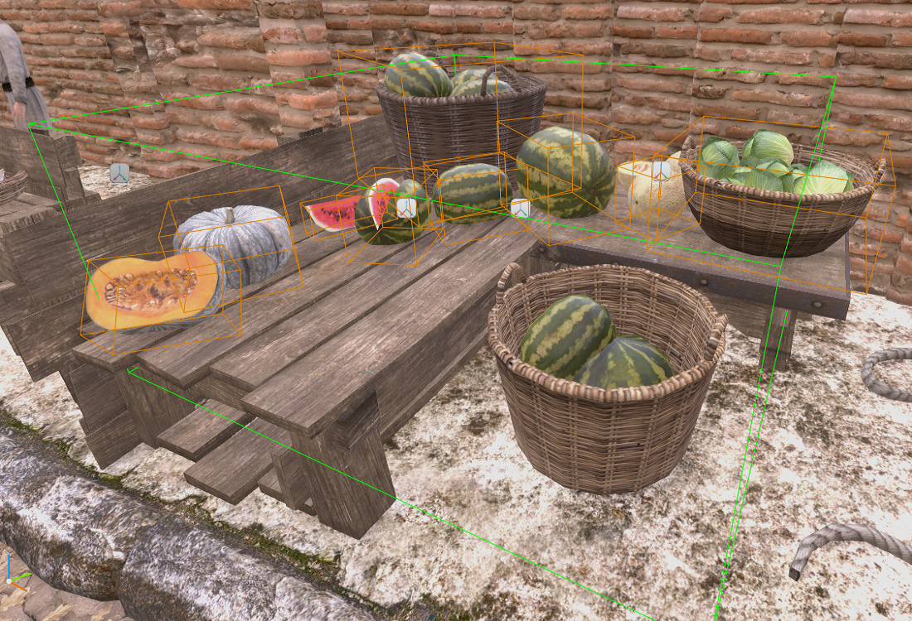
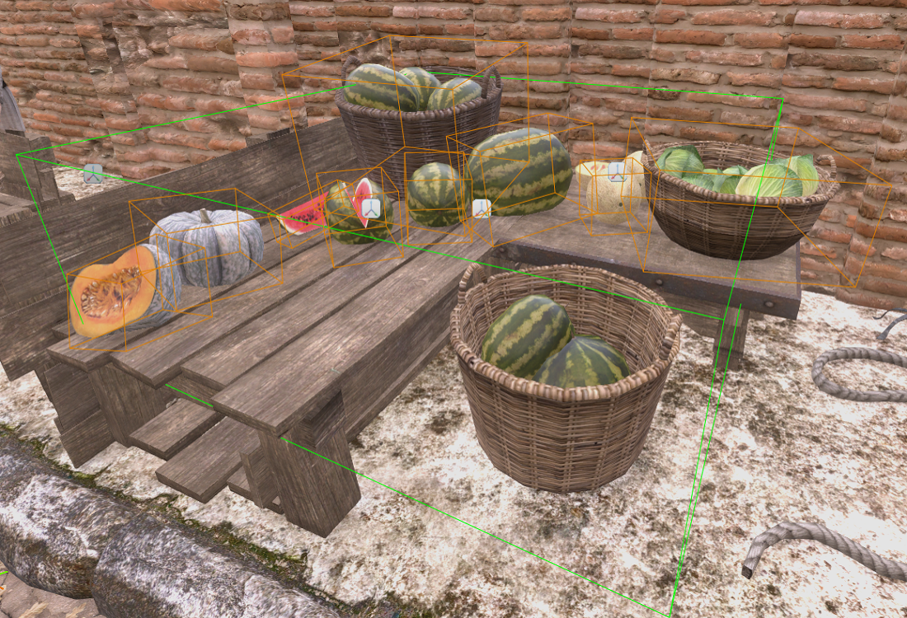

Mass Selection script allows you to select objects in a box and apply random rotations to selected objects. You can relocate and resize the selection box with translating, rotating and scaling entity which has “mass_selection” script. Bounding Box Constraint property allows you to select objects which has smaller bounding box than it’s value.

|LOCATE SELECTION BOX|AFTER SELECT OBJECTS|AFTER APPLY RANDOM ROTATIONS|
|-|-|-|
||||

