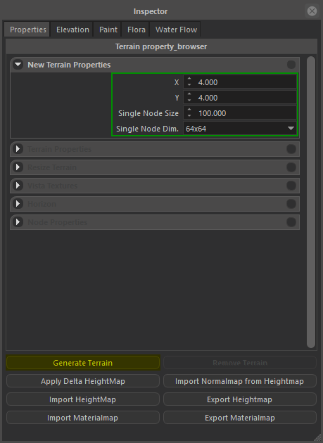
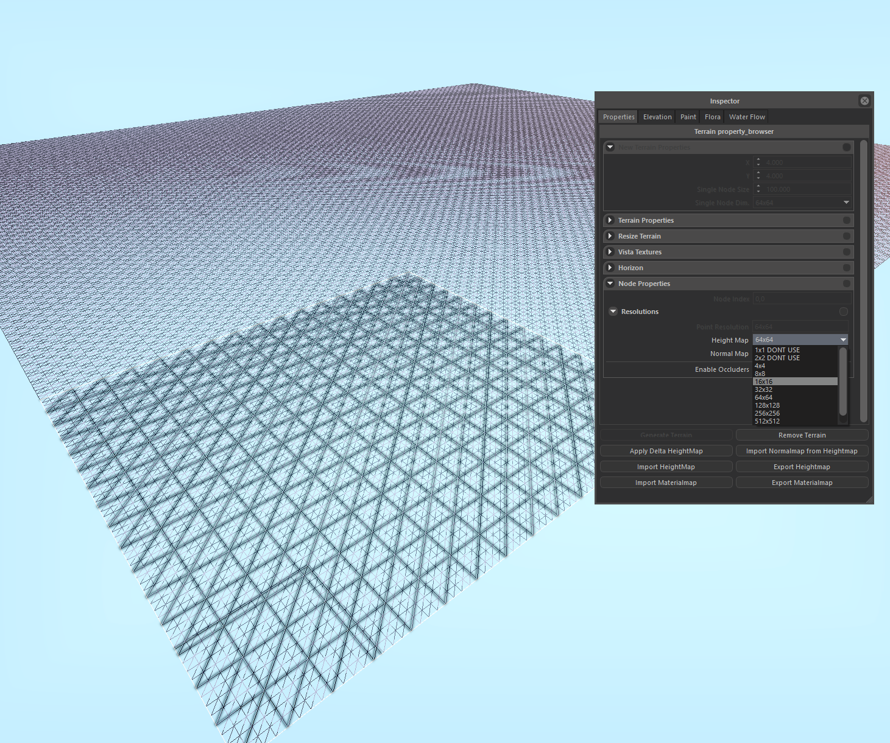
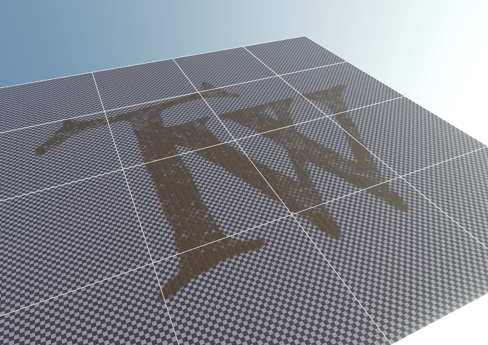

## Create a new terrain

Terrain creation, removal, and node modifications can be done in Terrain Inspector > Properties tab.

Terrain node count in both dimensions, their resolution and size can be specified in **New Terrain Properties** panel.

This parameters must be specified proir to the creation, although they can be canged per-node basis later.

|                              |                                         |
| ---------------------------- | --------------------------------------- |
|  |  |

## Adjusting node properties

Node resolution can be adjusted by selection nodes (Hold CTRL for multiple selection)m and change the resolution parameter in **Node Properties** panel.

This feature can be used to further optimize terrain in places where resolution is not that important (eg. Outside of Settlemets where player is not allowed to go, or nodes that are completely under water).

## Import / Export Materialmaps or Heightmap

To support external terrain generation softwares, engine can Import / Export terrain layer materialmaps or heightmap. You can easly create believable terrains by importing various layers (Debris, flowmap, vegetation, bedrock), and 16-bit heightmaps. To import a materialmap, first you must create a new terrain layer, after selecting this layer, go to Properties tab, select some nodes (CTRL + A to select all) and hit Import Materialmap button. This will open file selection dialog, you can select any 8-bit (grayscale) texture to use as materialmap. You can do the same to import Heightmap, heightmaps can be 8-bit or 16-bit (png or raw).

||||||
|-|-|-|-|-|
||||||

